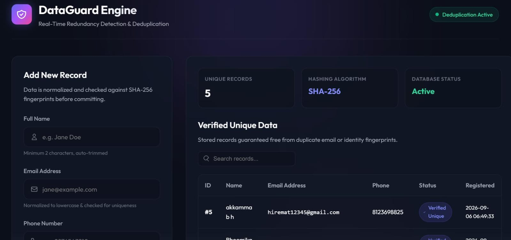
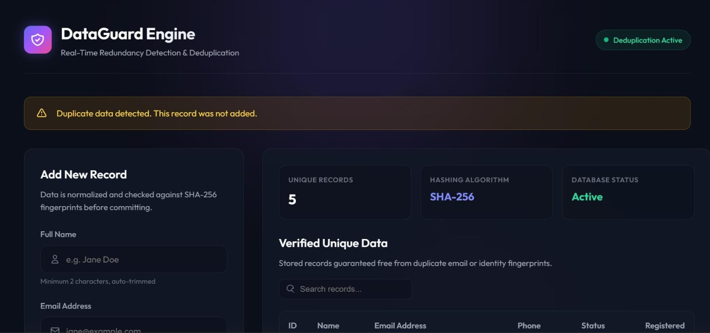

# CodeAlpha Data Redundancy Removal System

A Flask-based web application that detects and prevents duplicate records using SHA-256 hashing and SQLite database validation.

## 📌 Project Overview

The Data Redundancy Removal System is designed to identify duplicate data records before they are stored in the database.

The application generates a unique SHA-256 hash for each record and compares it with existing records. If the same data is submitted again, the system detects it as a duplicate and prevents redundant storage.

The system provides a simple web-based dashboard for adding records, viewing verified unique records, searching existing data, and receiving real-time duplicate detection alerts.

## 🚀 Features

- Duplicate data detection
- SHA-256 hashing for record verification
- SQLite database integration
- Add and store unique records
- Search existing records
- Real-time duplicate alerts
- Data validation and normalization
- Clean and responsive web interface
- Secure handling of ignored local files using `.gitignore`

## 🛠️ Technologies Used

- Python
- Flask
- SQLite
- HTML5
- CSS3
- SHA-256 Hashing
- Git
- GitHub

## 📂 Project Structure

```text
CodeAlpha_DataRedundancyRemoval/
│
├── app.py
├── database.py
├── requirements.txt
├── README.md
├── .gitignore
├── pyrightconfig.json
│
├── templates/
│   └── index.html
│
└── static/
    └── css/
        └── style.css
```

## 📷 Application Preview

### Dashboard

The DataGuard Engine dashboard provides a real-time view of unique records, SHA-256 hashing, database status, and verified data.



### Duplicate Detection

The system automatically detects duplicate records and prevents them from being added to the database.



## ⚙️ How to Run the Project

### 1. Clone the repository

```bash
git clone https://github.com/SINCHANA-S-H/CodeAlpha_DataRedundancyRemoval.git
```

### 2. Navigate to the project directory

```bash
cd CodeAlpha_DataRedundancyRemoval
```

### 3. Create a virtual environment

```bash
python -m venv venv
```

### 4. Activate the virtual environment

#### Windows PowerShell

```powershell
.\venv\Scripts\Activate.ps1
```

#### Windows Command Prompt

```cmd
venv\Scripts\activate
```

### 5. Install the required dependencies

```bash
pip install -r requirements.txt
```

### 6. Run the Flask application

```bash
python app.py
```

### 7. Open the application

Open the following address in your web browser:

```text
http://127.0.0.1:5000
```

## 🔍 How the System Works

1. The user enters a name, email address, and phone number.
2. The application validates and normalizes the input data.
3. A SHA-256 fingerprint is generated for the record.
4. The generated fingerprint is compared with existing records.
5. If the record already exists, it is identified as duplicate.
6. Duplicate records are rejected to prevent redundant storage.
7. Unique records are stored in the SQLite database.
8. The dashboard displays the verified unique records.

## 🔐 Data Redundancy Prevention

The system uses SHA-256 hashing to create a fingerprint for each record.

This fingerprint allows the application to compare incoming records with previously stored records and identify duplicate data before inserting it into the database.

## 🗄️ Database

The application uses SQLite for local data storage.

The database is created automatically when the application starts.

The local database file is excluded from version control using `.gitignore`.

## 📋 Requirements

The project dependencies are listed in:

```text
requirements.txt
```

Install them using:

```bash
pip install -r requirements.txt
```

## 🔒 Git & Security

The project uses `.gitignore` to prevent local and environment-specific files from being uploaded to GitHub.

Ignored files include:

- `venv/`
- `__pycache__/`
- `*.pyc`
- `data.db`
- `.env`
- `.vscode/`

Sensitive configuration values can be supplied through environment variables rather than being stored directly in the source code.

## 🎯 Project Objective

The objective of this project is to demonstrate how hashing, database validation, and web application development can be combined to reduce redundant data storage and improve data integrity.

## 👩‍💻 Project Status

**Status: Completed**

The application has been functionally tested for:

- Adding unique records
- Detecting duplicate records
- Preventing duplicate database entries
- Displaying stored records
- Searching records
- SHA-256 based record verification
- SQLite database integration

## 📄 Internship Project

This project was developed as part of the **CodeAlpha Internship**.